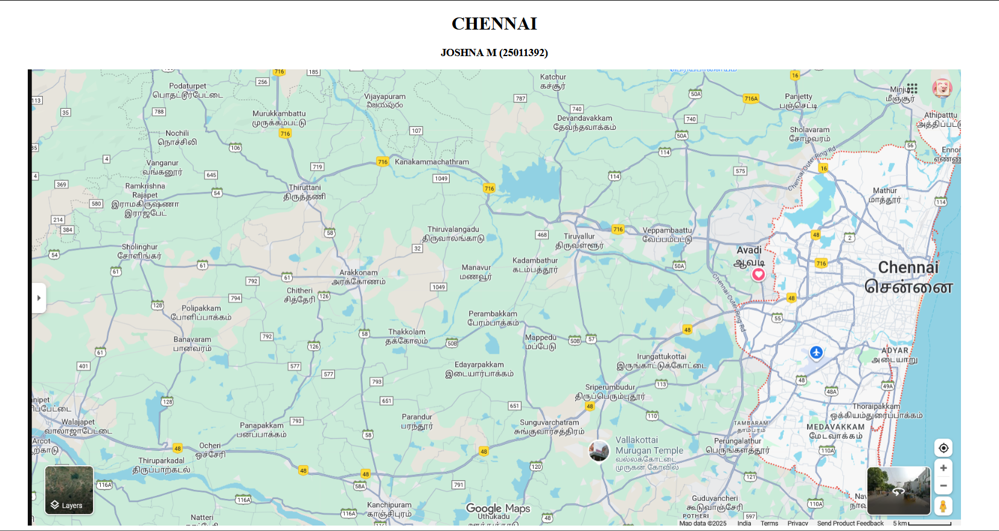
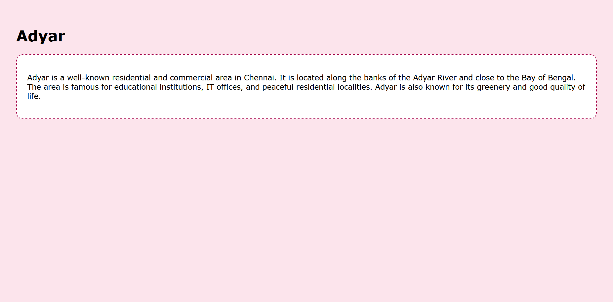
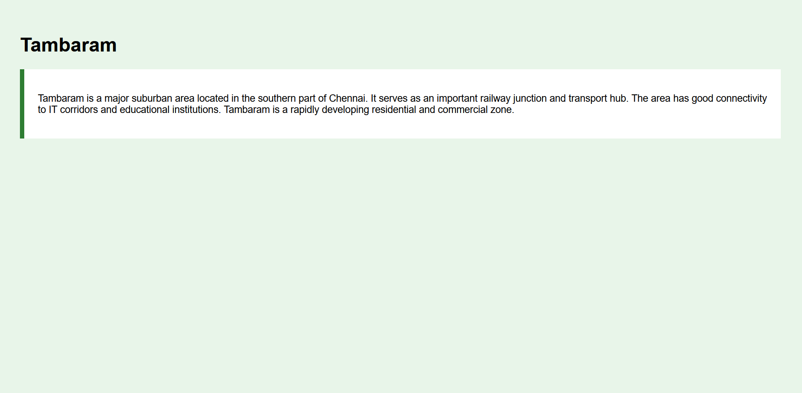
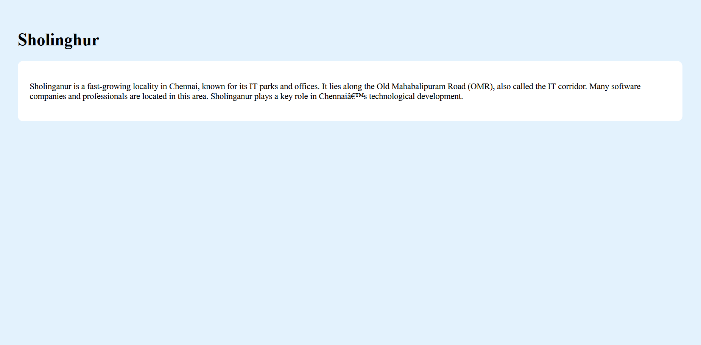
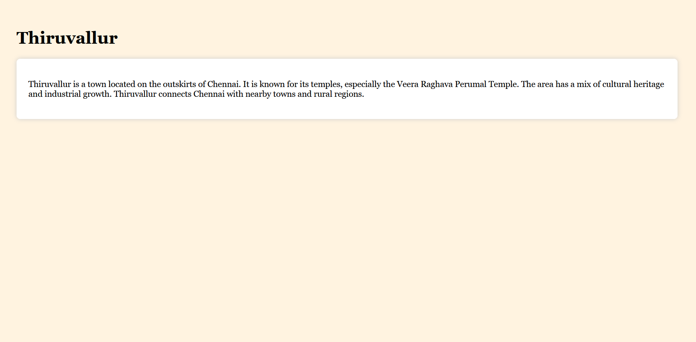

# Ex04 Places Around Me
## Date: 14/12/2025

## AIM
To develop a website to display details about the places around my house.

## DESIGN STEPS

### STEP 1
Create a Django admin interface.

### STEP 2
Download your city map from Google.

### STEP 3
Using ```<map>``` tag name the map.

### STEP 4
Create clickable regions in the image using ```<area>``` tag.

### STEP 5
Write HTML programs for all the regions identified.

### STEP 6
Execute the programs and publish them.

## CODE
```
map.html

<!DOCTYPE html>
<html>
<head>
    <title>My City</title>

    <style>
        img {
            max-width: 100%;
            height: auto;
            display: block;
            margin: auto;
        }
    </style>
</head>

<body>
    <h1 style="text-align:center;">CHENNAI</h1>
    <h3 style="text-align:center;">JOSHNA M (25011392)</h3>

    

    <map name="image-map">
        <area alt="Sholinghur" href="Sholinghur.html" coords="221,367,66" shape="circle">
        <area alt="Tambaram" href="Tambaram.html" coords="1440,705,60" shape="circle">
        <area alt="Thiruvallur" href="Thiruvallur.html" coords="1098,335,58" shape="circle">
        <area alt="Adyar" href="Adyar.html" coords="1728,572,64" shape="circle">
    </map>

    <!-- ✅ PLACE LIST HERE -->
    <hr>

    <h2>Places in Chennai</h2>

    <ul>
        <li><a href="Adyar.html">Adyar</a></li>
        <li><a href="Tambaram.html">Tambaram</a></li>
        <li><a href="Sholinghur.html">Sholinghur</a></li>
        <li><a href="Thiruvallur.html">Thiruvallur</a></li>
    </ul>

</body>
</html>

Adyar.html

<!DOCTYPE html>
<html>
<head>
    <title>Adyar</title>
    <style>
        body {
            background-color: #fce4ec;
            font-family: Verdana, sans-serif;
            margin: 0;
            padding: 40px;
        }
        .section {
            background: white;
            padding: 25px;
            border-radius: 15px;
            border: 2px dashed #ad1457;
        }
    </style>
</head>
<body>
    <h1>Adyar</h1>
    <div class="section">
        <p>
            Adyar is a well-known residential and commercial area in Chennai.
            It is located along the banks of the Adyar River and close to the Bay of Bengal.
            The area is famous for educational institutions, IT offices, and peaceful residential localities.
            Adyar is also known for its greenery and good quality of life.
        </p>
    </div>
</body>
</html>

Tambaram.html

<!DOCTYPE html>
<html>
<head>
    <title>Tambaram</title>
    <style>
        body {
            background-color: #e8f5e9;
            font-family: Arial, sans-serif;
            margin: 0;
            padding: 40px;
        }
        .card {
            background: #ffffff;
            padding: 25px;
            border-left: 8px solid #2e7d32;
        }
    </style>
</head>
<body>
    <h1>Tambaram</h1>
    <div class="card">
        <p>
            Tambaram is a major suburban area located in the southern part of Chennai.
It serves as an important railway junction and transport hub.
The area has good connectivity to IT corridors and educational institutions.
Tambaram is a rapidly developing residential and commercial zone.
        </p>
    </div>
</body>
</html>

Sholinghur.html

<!DOCTYPE html>
<html>
<head>
    <title>Sholinghur</title>
    <style>
        body {
            background-color: #e3f2fd;
            font-family: "Times New Roman", serif;
            margin: 0;
            padding: 40px;
        }
        .box {
            background: white;
            padding: 25px;
            border-radius: 12px;
        }
    </style>
</head>
<body>
    <h1>Sholinghur</h1>
    <div class="box">
        <p>
            Sholinganur is a fast-growing locality in Chennai, known for its IT parks and offices.
It lies along the Old Mahabalipuram Road (OMR), also called the IT corridor.
Many software companies and professionals are located in this area.
Sholinganur plays a key role in Chennai’s technological development.
        </p>
    </div>
</body>
</html>

Thiruvallur.html

<!DOCTYPE html>
<html>
<head>
    <title>Thiruvallur</title>
    <style>
        body {
            background-color: #fff3e0;
            font-family: Georgia, serif;
            margin: 0;
            padding: 40px;
        }
        .content {
            background: #ffffff;
            padding: 25px;
            border-radius: 8px;
            box-shadow: 0 0 10px #ccc;
        }
    </style>
</head>
<body>
    <h1>Thiruvallur</h1>
    <div class="content">
        <p>
            Thiruvallur is a town located on the outskirts of Chennai.
It is known for its temples, especially the Veera Raghava Perumal Temple.
The area has a mix of cultural heritage and industrial growth.
Thiruvallur connects Chennai with nearby towns and rural regions.
        </p>
    </div>
</body>
</html>

```


## OUTPUT







## RESULT
The program for implementing image maps using HTML is executed successfully.
